# InStadium

InStadium is a cross-platform stadium discovery and fan-engagement platform built around three experiences:

- Mobile-first exploration of stadiums, sports, players, and upcoming matches
- Assisted discovery using search, geolocation, and QR-based deep links
- Content and operations support through backend APIs for inquiries, events, media, and client workflows

This README is architecture-first and flow-first. It gives a complete high-level view with enough technical baseline for production readiness, while leaving clear space for deeper technical appendices you can add later.

## 1) Product Vision (High Level)

### What the platform does

- Helps fans find stadiums quickly based on sport, city, and proximity
- Offers rich stadium detail pages with galleries, timelines, match windows, and nearby context
- Enables instant stadium access via QR scans and deep links
- Supports communication loops through inquiries, press/media, and event operations
- Provides authentication-aware experiences for protected capabilities

### Who uses InStadium

- Sports fans and visitors
- Team/media operations
- Event and inquiry administrators
- Partner/client users through portal-facing endpoints

## 2) System Context Diagram

This diagram shows the platform boundary and its major external actors and services.
It explains where user interactions terminate and which external systems are used for identity, data, and enrichment.
Use this as the top-level reference before looking at internal architecture.

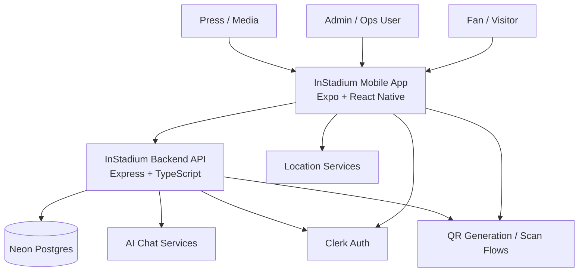

## 3) Container Architecture

This view breaks the system into runtime containers: mobile client, API services, and data/integration layer.
It highlights the primary dependency direction and helps reason about ownership boundaries.
This is useful for release planning and component-level responsibility mapping.

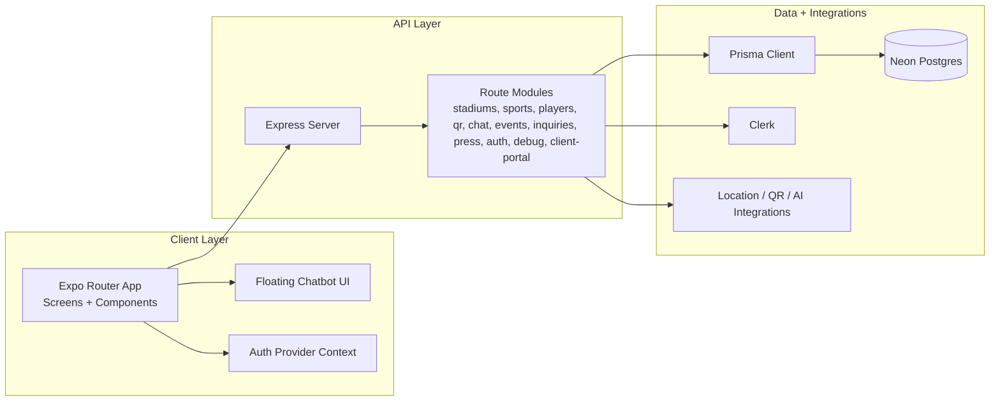

## 4) App Functional Map

This map presents the functional pillars of the app and the user-facing capabilities inside each pillar.
It is intentionally grouped by business function so product, design, and engineering can discuss scope with the same model.
The category blocks use a consistent light palette for clear readability.

```mermaid
flowchart TB
      root([InStadium App])

      discovery[Discovery]
      experience[Stadium Experience]
      engagement[Engagement]
      access[Access]
      entry[Entry Points]

      d1[Explore Feed]
      d2[Sports Index]
      d3[Search Stadium]
      d4[Find Stadium Nearby]

      e1[Hero and Overview]
      e2[Gallery]
      e3[Timeline]
      e4[Matches]
      e5[Players]
      e6[Maps and Nearby Places]

      g1[Floating Chatbot]
      g2[Inquiries]
      g3[Press and Media]
      g4[Events]

      a1[Clerk Sign In and Sign Up]
      a2[Authenticated Endpoints]
      a3[Client Portal]

      p1[Home Navigation]
      p2[QR Scan and Resolve]
      p3[Deep Link Open]

      root --> discovery
      root --> experience
      root --> engagement
      root --> access
      root --> entry

      discovery --> d1
      discovery --> d2
      discovery --> d3
      discovery --> d4

      experience --> e1
      experience --> e2
      experience --> e3
      experience --> e4
      experience --> e5
      experience --> e6

      engagement --> g1
      engagement --> g2
      engagement --> g3
      engagement --> g4

      access --> a1
      access --> a2
      access --> a3

      entry --> p1
      entry --> p2
      entry --> p3

      style discovery fill:#dbeafe,stroke:#1d4ed8,color:#0f172a
      style experience fill:#dbeafe,stroke:#1d4ed8,color:#0f172a
      style engagement fill:#dbeafe,stroke:#1d4ed8,color:#0f172a
      style access fill:#dbeafe,stroke:#1d4ed8,color:#0f172a
      style entry fill:#dbeafe,stroke:#1d4ed8,color:#0f172a
```

## 5) Runtime Architecture (Request Path)

This sequence captures the most important runtime behavior: public content retrieval and authenticated profile validation.
It shows where identity validation happens and where data retrieval happens.
This helps confirm separation between authentication provider and application data store.

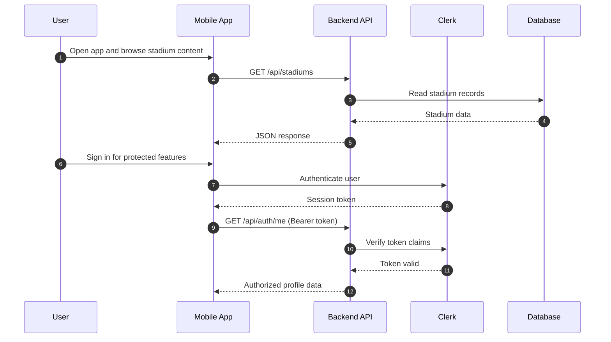

## 6) Data Flow Diagrams

### DFD Level 0 (Context)

This context DFD represents the system as one process and focuses on external data exchanges.
It is used for business-level communication and scoping integrations.
It intentionally avoids internal implementation details.

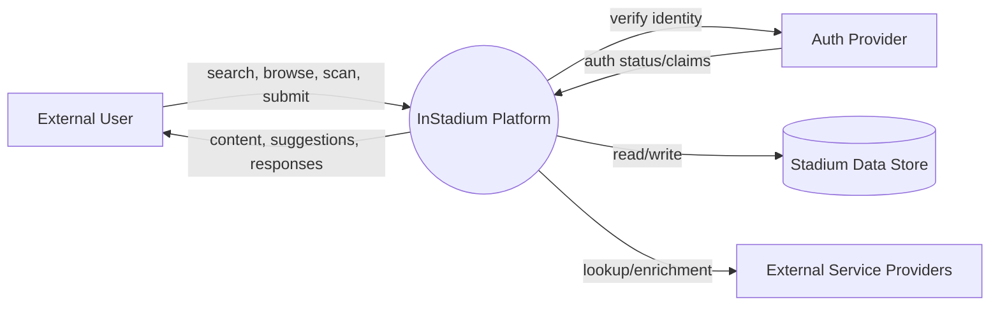

### DFD Level 1 (Operational)

This Level 1 DFD decomposes the platform into major operational processes.
It ties each process to internal data stores and selected external systems.
Use it to trace data ownership and identify operational dependencies.

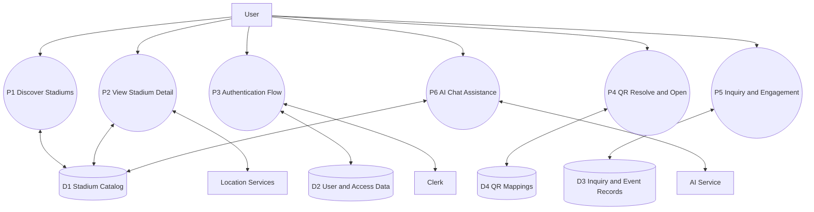

## 7) Primary User Journey Flow

This flow models the most common user path from app entry to meaningful action.
It combines multiple entry mechanisms such as search, nearby, QR, and assistant.
The final decision gate shows when authentication becomes necessary.

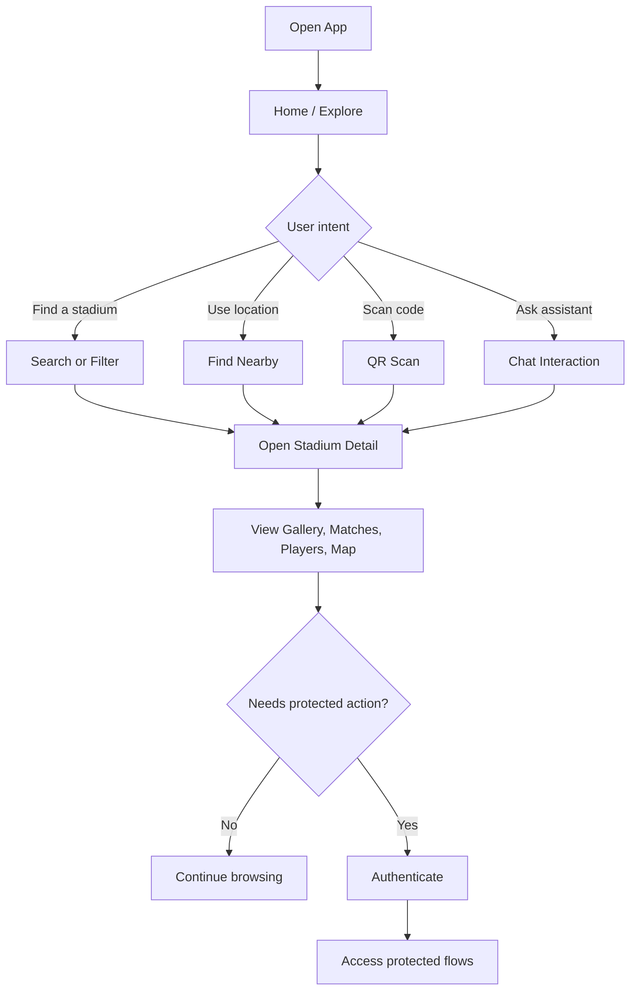

## 8) Activity Diagram: Stadium Discovery to Decision

This activity diagram drills into the discovery branch of the user journey.
It emphasizes iterative refinement and the repeated loop until a stadium is selected.
This is a practical baseline for UX and search quality improvements.

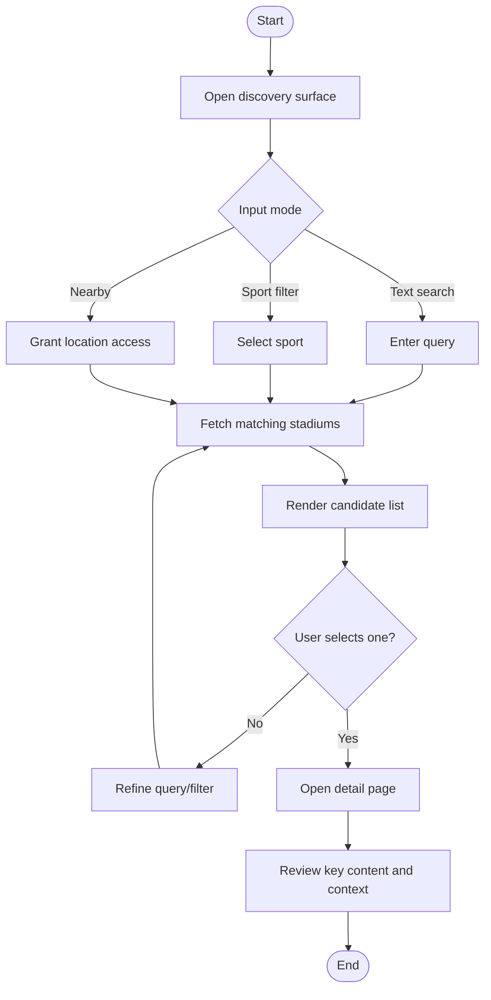

## 9) Activity Diagram: Authenticated Operations

This diagram describes the guardrail behavior around protected actions.
It shows the local auth check, backend token validation, and user recovery path.
Use it for designing secure access while preserving smooth UX.


## 10) Sequence Diagram: QR Flow

This sequence captures QR-driven navigation into a stadium detail page.
It highlights backend QR mapping lookup and deterministic deep-link resolution.
This is the reference flow for scan reliability and campaign QR operations.

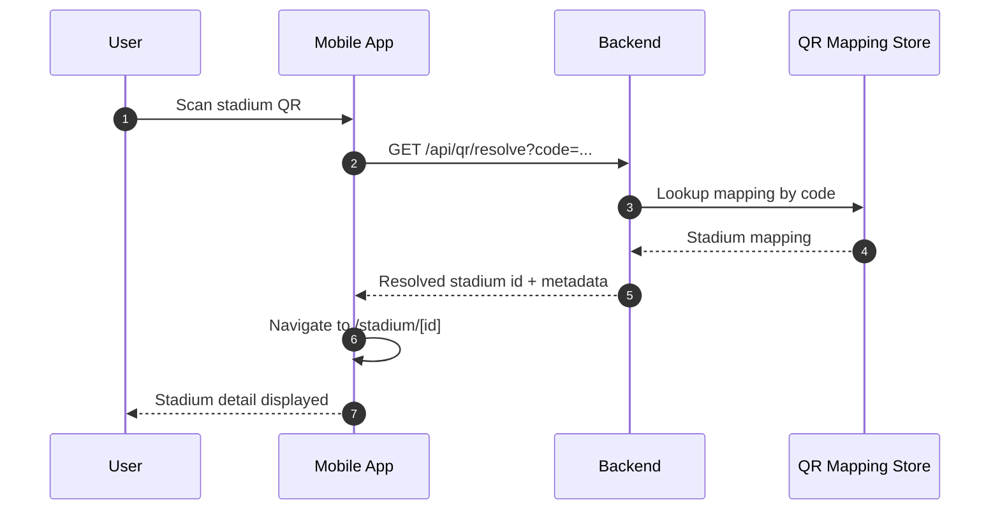

## 11) Sequence Diagram: Inquiry Submission

This sequence documents the inquiry creation lifecycle from client form to persistence.
It is the core business interaction for lead and communication workflows.
Use this as the baseline for acknowledgment and SLA handling later.

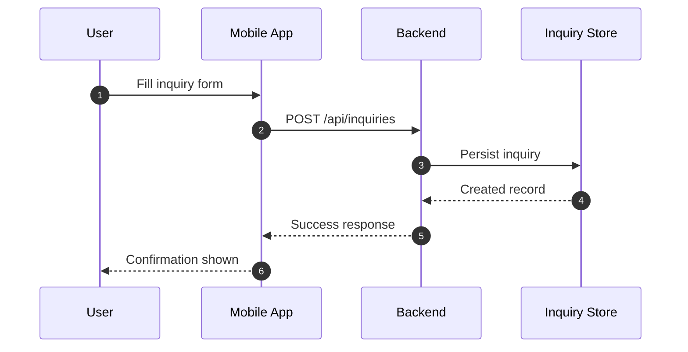

## 12) State Diagram: App Access and Interaction

This state model shows the major user-interaction states and transitions.
It separates public browsing, authenticated mode, and protected operations.
This is useful for reasoning about navigation, token lifecycle, and sign-out behavior.

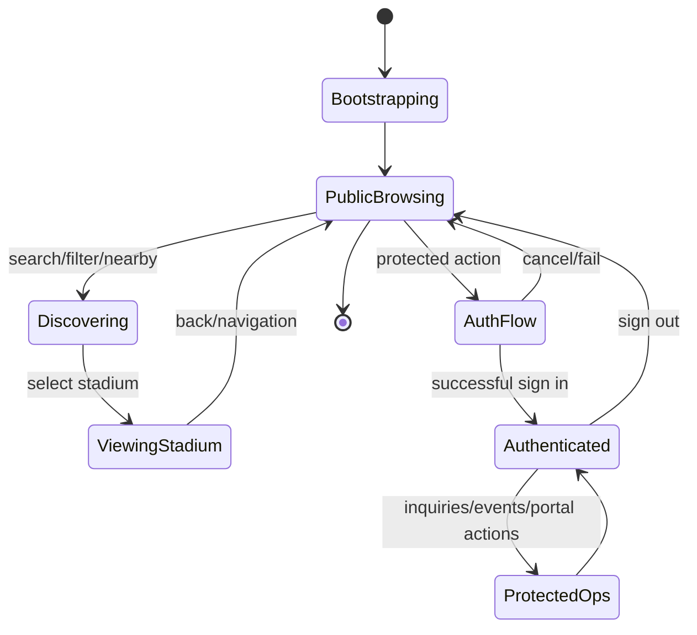

## 13) Backend Capability Map

This capability map groups route domains into public and protected areas.
It clarifies which domains are data-centric and which depend on external identity/services.
Use this as a handoff reference for backend ownership and API governance.

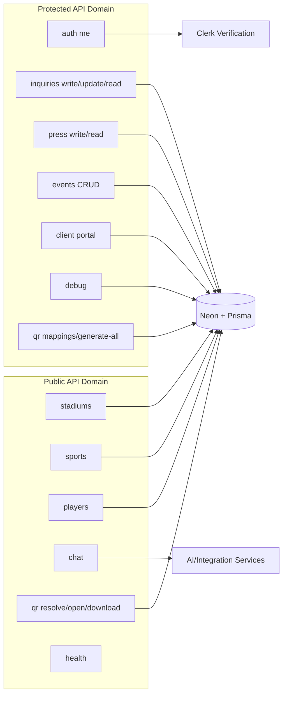

## 14) Deployment View (High Level)

This deployment diagram presents logical deployment zones and external managed dependencies.
It is intentionally cloud-agnostic while still showing production-critical runtime relationships.
Use it to align mobile, backend, and managed-service release planning.

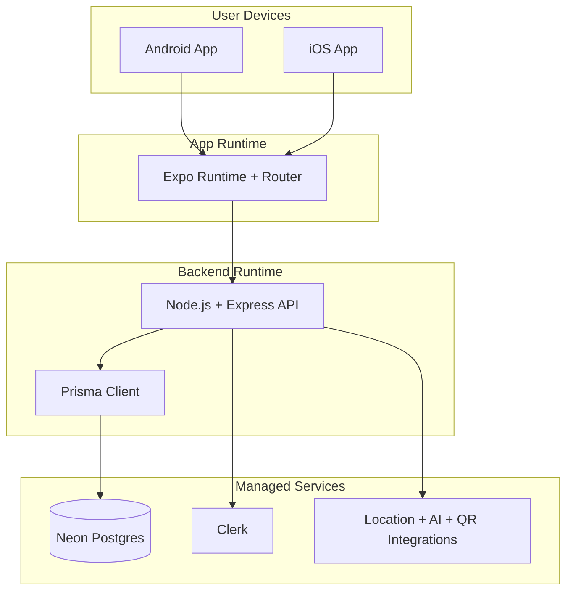

## 15) Repository Landscape

This view maps the codebase into practical engineering domains.
It is designed for onboarding and helps contributors locate where to add features.
Use this section as the navigation guide for repo-level collaboration.

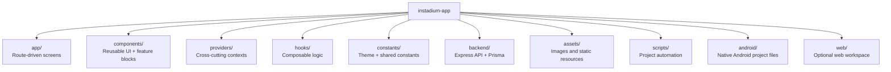

## 16) Non-Technical Feature Summary

- Stadium discovery and exploration journey
- Rich stadium content presentation
- Multi-entry navigation (search, nearby, QR)
- Assisted conversational support via chatbot surface
- Role-aware and token-aware protected operations
- Event and inquiry operations for business workflows

## 17) Technical Baseline (Production Grade)

This section gives a concise but practical technical baseline for operating and evolving the platform.
It is not a deep implementation manual, but it is sufficient for engineering planning and production alignment.
Detailed technical internals can be expanded in the reserved appendices below.

### 17.1 Core Technology Stack

- Mobile App: Expo 54, React Native 0.81, Expo Router, TypeScript
- Backend API: Node.js, Express, TypeScript
- Data Access: Prisma Client with PostgreSQL adapter
- Primary Database: Neon Postgres
- Identity and Access: Clerk tokens and claim verification
- Integrations: Location providers, QR workflows, AI-assisted chat path

### 17.2 Service Responsibility Model

- Mobile layer handles rendering, local interaction state, and user input orchestration
- API layer handles business rules, route authorization, and integration dispatch
- Data layer persists core entities and operational records
- External services provide identity, enrichment, and selected intelligence capabilities

### 17.3 API Domain Summary

- Discovery Domain: stadiums, sports, players
- Engagement Domain: inquiries, press, events, chat
- Access Domain: auth profile resolution, client portal, admin and debug surfaces
- Utility Domain: health checks, QR resolve/open/download and mapping generation

### 17.4 Data Domains (High Level)

- Catalog Data: stadium metadata, sport associations, media assets, match windows
- Operational Data: inquiries, event records, QR mappings
- Access Context: claims-backed profile context and protected-route policy inputs

### 17.5 Security and Access Posture

- Protected routes require bearer-token validation via Clerk-backed claims
- Public routes remain open only for safe read-oriented discovery capabilities
- Role and admin constraints are applied through configured allow-lists where required
- CORS and secure headers are enforced at API boundary level

### 17.6 Reliability and Operations Baseline

- Health endpoint available for service checks and runtime verification
- API startup includes port fallback logic for local and shared development reliability
- Structured logging middleware is enabled for request-level observability
- Environment-driven configuration supports deployment-specific tuning

### 17.7 Configuration Baseline

- Root app environment defines client runtime API base URL and auth publishable keys
- Backend environment defines database connections, auth issuer details, and service keys
- Optional integration flags and endpoints are configured through explicit env vars

### 17.8 Delivery Readiness Notes

- Route-level ownership is domain grouped for maintainable scaling
- App and backend can run independently but are designed for concurrent local integration
- Current structure supports phased rollout of deeper API and data documentation

## 18) Quick Start (Operational)

### App

1. Install dependencies:

```bash
npm install
```

2. Start Expo:

```bash
npm run start
```

### Backend (from app root)

```bash
npm run backend:dev
```

## 19) Reserved Space for Future Deep Technical Documentation

These sections are intentionally left for detailed engineering depth so this README stays readable while still being complete.

### 19.1 API Contract Details (To Be Expanded)

- Endpoint-by-endpoint request and response contracts
- Validation schema references and error code taxonomy
- Authorization matrix by route, role, and environment

### 19.2 Data Model and Schema Details (To Be Expanded)

- Entity relationship diagrams and index strategy
- Migration workflows and backward-compatibility policy
- Data lifecycle, retention, archival, and recovery playbooks

### 19.3 Security and Compliance Details (To Be Expanded)

- Threat model, trust boundaries, and abuse scenarios
- Secret rotation, credential policies, and audit strategy
- Compliance mapping for required controls

### 19.4 Performance and Reliability Details (To Be Expanded)

- SLO, error budget, and incident response model
- Performance test strategy and capacity planning
- Query optimization, caching, and degradation paths

### 19.5 CI/CD and Release Engineering Details (To Be Expanded)

- Branching strategy and deployment promotion rules
- Quality gates, rollback plans, and hotfix procedures
- Release checklist and post-release verification

### 19.6 Mobile Platform Engineering Details (To Be Expanded)

- Device capability matrix and platform-specific caveats
- Offline behavior and synchronization strategy
- Notification delivery policies and retry model

## 20) Documentation Status

- High-level architecture: complete
- High-level data and activity flows: complete
- Production-grade technical baseline: complete
- Deep technical appendices: intentionally reserved for next phase

---

Next expansion can add a formal C4 package, endpoint contract tables, and runbook templates as separate documents under a docs folder.
