# InStadium

InStadium is a cross-platform stadium discovery and fan-engagement platform built around three experiences:

- Mobile-first exploration of stadiums, sports, players, and upcoming matches
- Assisted discovery using search, geolocation, and QR-based deep links
- Content and operations support through backend APIs for inquiries, events, media, and client workflows

This README is intentionally architecture-first and flow-first. It gives a complete high-level view now, while leaving dedicated placeholders for deep technical specs you can add later.

## 1) Product Vision (High Level)

### What the platform does

- Helps fans find stadiums quickly based on sport, city, and proximity
- Offers rich stadium detail pages with galleries, timelines, match windows, and nearby context
- Enables instant stadium access via QR scans and deep links
- Supports communication loops through inquiries, press/media, and event operations
- Provides authentication-aware experiences for protected capabilities

### Who uses InStadium

- Sports fans and visitors
- Team/media operations
- Event and inquiry administrators
- Partner/client users through portal-facing endpoints

## 2) System Context Diagram

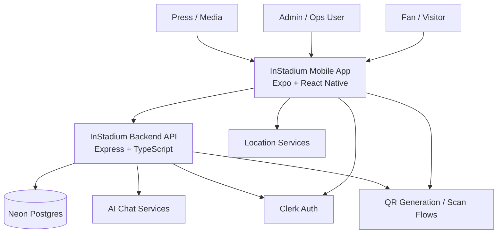

## 3) Container Architecture

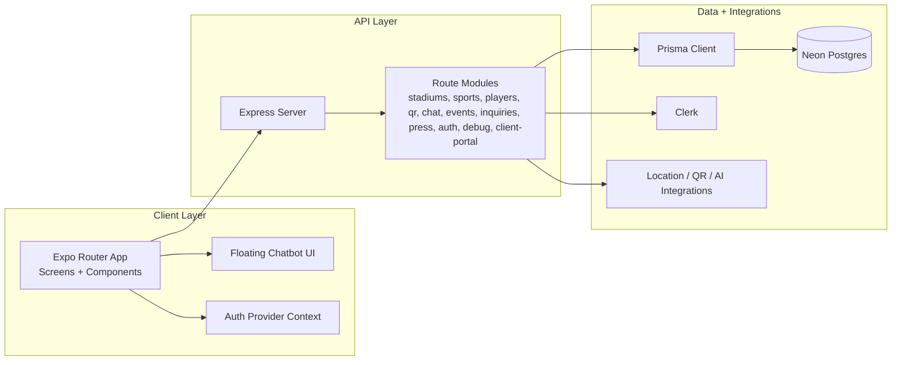

## 4) App Functional Map

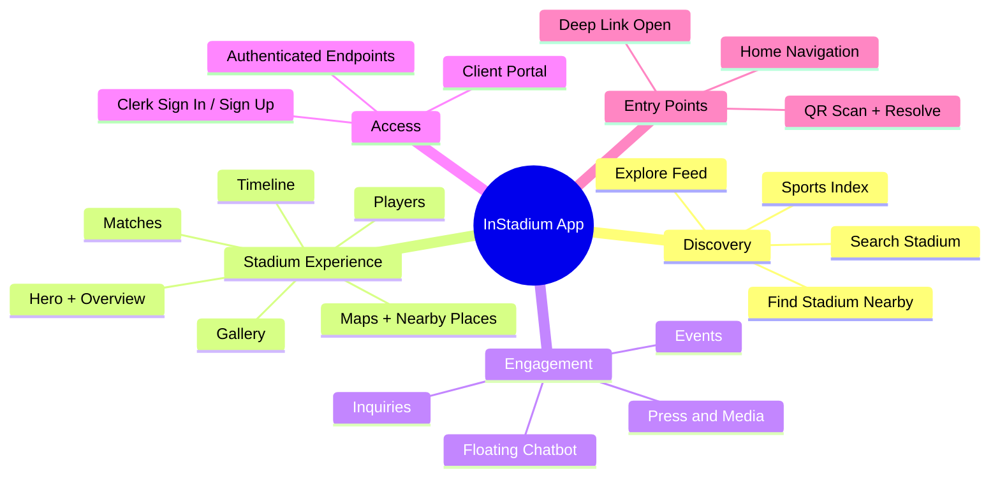

## 5) Runtime Architecture (Request Path)

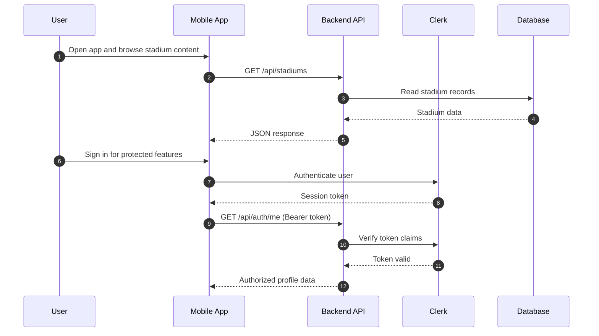

## 6) Data Flow Diagrams

### DFD Level 0 (Context)

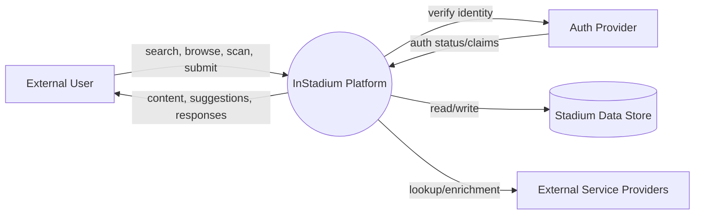

### DFD Level 1 (Operational)

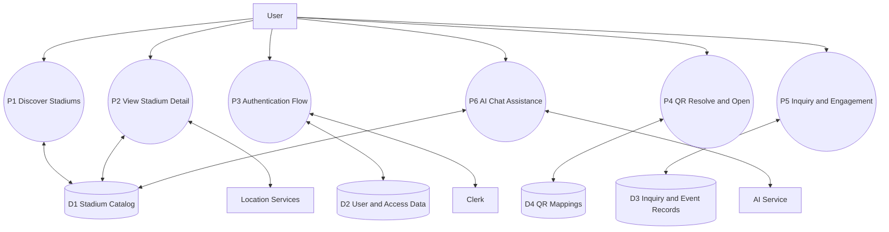

## 7) Primary User Journey Flow

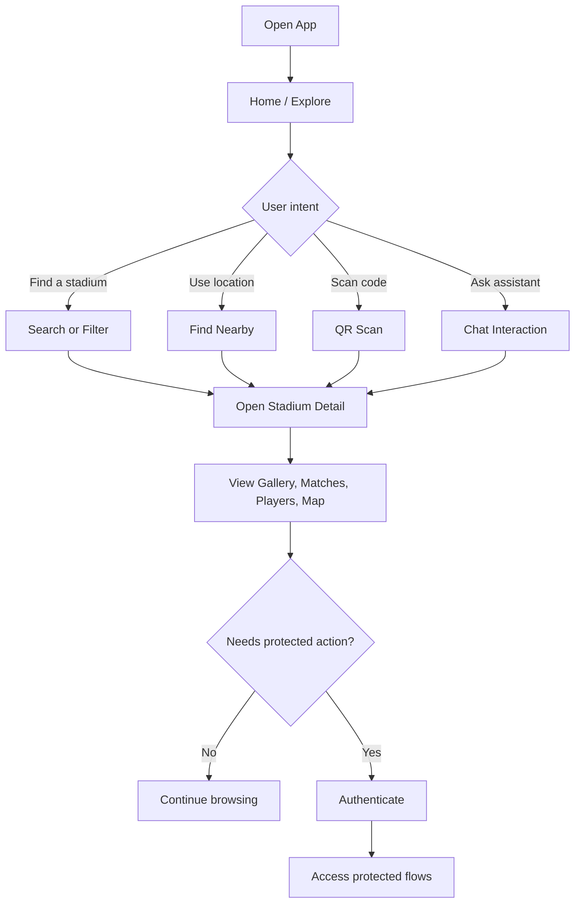

## 8) Activity Diagram: Stadium Discovery to Decision


## 9) Activity Diagram: Authenticated Operations

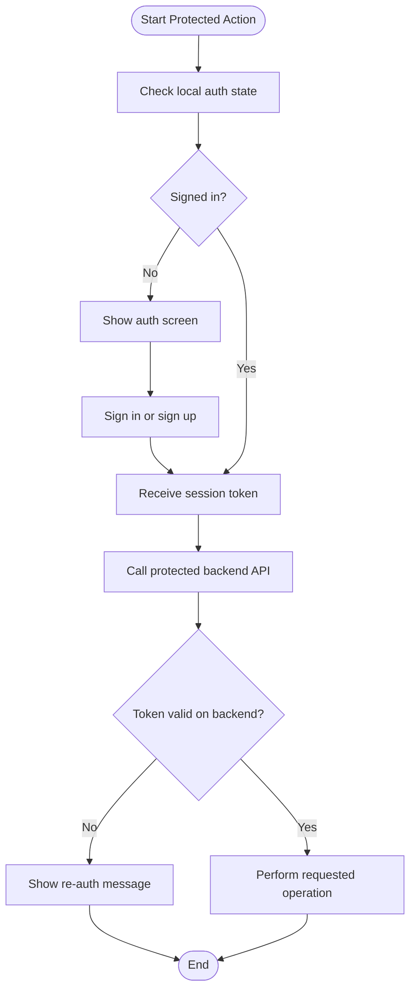

## 10) Sequence Diagram: QR Flow

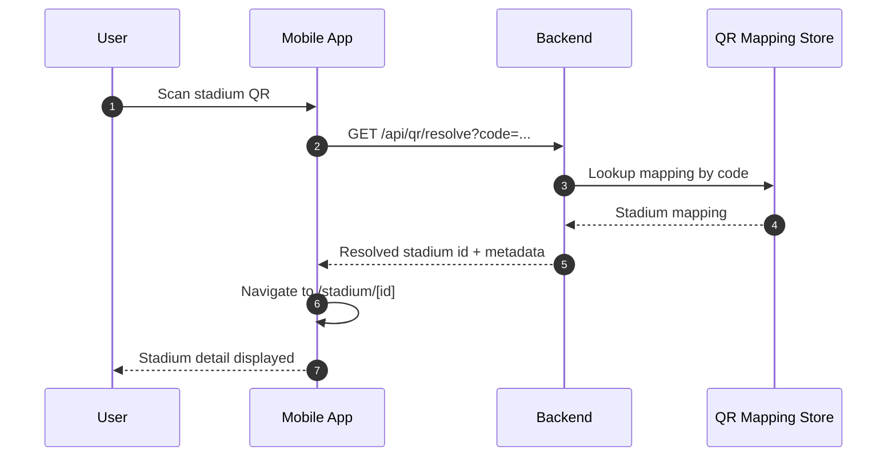

## 11) Sequence Diagram: Inquiry Submission

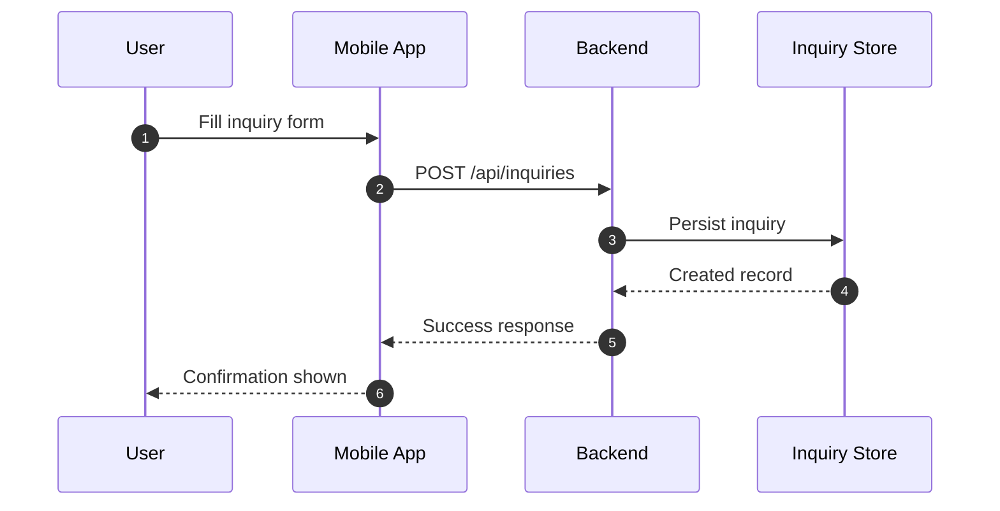

## 12) State Diagram: App Access and Interaction

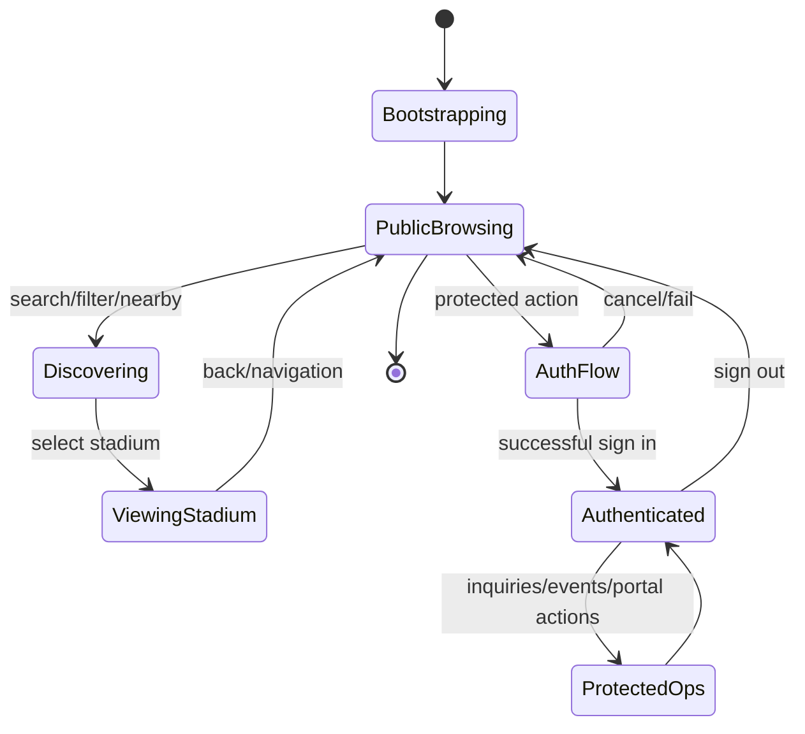

## 13) Backend Capability Map

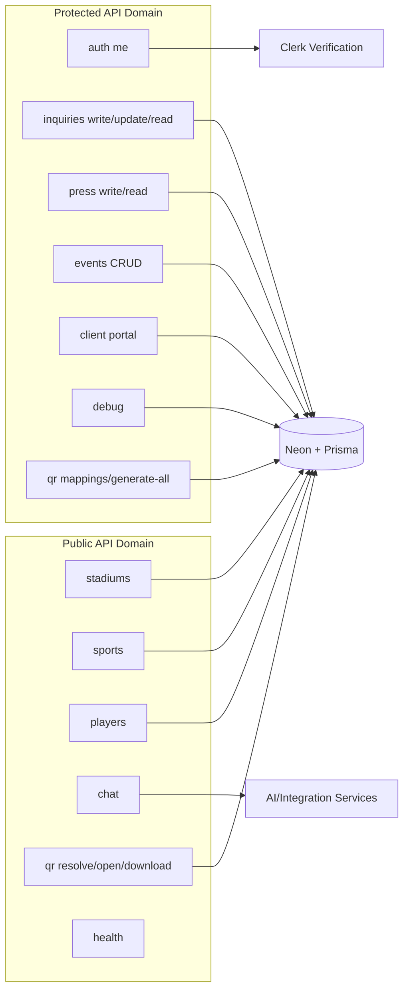

## 14) Deployment View (High Level)

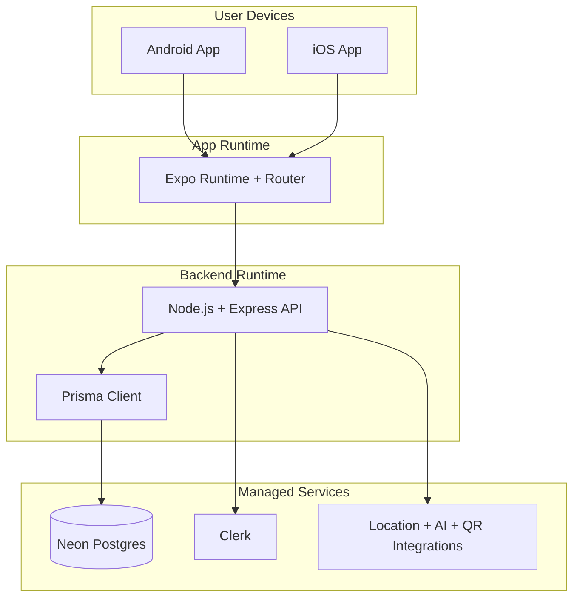

## 15) Repository Landscape

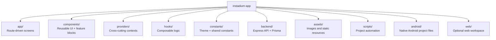

## 16) Non-Technical Feature Summary

- Stadium discovery and exploration journey
- Rich stadium content presentation
- Multi-entry navigation (search, nearby, QR)
- Assisted conversational support via chatbot surface
- Role-aware and token-aware protected operations
- Event and inquiry operations for business workflows

## 17) Reserved Space for Future Technical Documentation

The following sections are intentionally left as expandable placeholders so you can add detailed engineering depth later.

### 17.1 API Contract Details (To Be Added)

- Endpoint-by-endpoint request/response contracts
- Validation rules and error payload matrix
- Authorization matrix by route and role

### 17.2 Data Model and Schema Details (To Be Added)

- Entity relationship diagrams
- Migration strategy and schema evolution policy
- Data retention and archival approach

### 17.3 Security and Compliance Details (To Be Added)

- Threat model and trust boundaries
- Secrets and key management strategy
- Audit trails, observability, and access governance

### 17.4 Performance and Reliability Details (To Be Added)

- SLO and SLA definitions
- Caching, pagination, and query-performance notes
- Load testing and incident response workflow

### 17.5 CI/CD and Release Engineering Details (To Be Added)

- Branching and release cadence
- Build pipeline and quality gates
- Rollback and hotfix procedures

### 17.6 Mobile Platform Engineering Details (To Be Added)

- Native module and device capability matrix
- Offline behavior and sync strategy
- Notification delivery model and retry behavior

## 18) Quick Start (Operational)

### App

1. Install dependencies:

```bash
npm install
```

2. Start Expo:

```bash
npm run start
```

### Backend (from app root)

```bash
npm run backend:dev
```

## 19) Documentation Status

- High-level architecture: complete
- High-level data and activity flows: complete
- Detailed technical reference: pending (reserved sections included)

---
